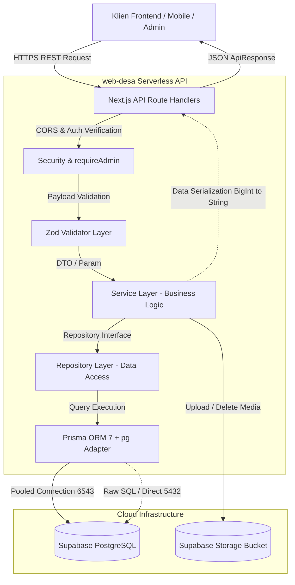

# 01. Arsitektur Backend — Web Desa Pringgodani

Dokumen ini menjelaskan rancangan arsitektur, prinsip desain, alur data, serta struktur internal kode backend `web-desa`.

---

## 1. Gambaran Umum Sistem (*System Overview*)

Backend `web-desa` dibangun menggunakan **Next.js 16 App Router (Route Handlers)** sebagai REST API *Serverless* berkinerja tinggi. Backend ini berfungsi sebagai *Single Source of Truth* untuk seluruh data operasional Desa Pringgodani, menghubungkan aplikasi klien publik dan panel admin dengan basis data **PostgreSQL** melalui **Prisma ORM 7**.

### Diagram Arsitektur Tingkat Tinggi



---

## 2. Pola Arsitektur: *Modular Clean Architecture*

Backend `web-desa` mengadopsi prinsip **Clean Architecture & Separation of Concerns** yang dibagi ke dalam 4 layer utama:

```
┌─────────────────────────────────────────────────────────────┐
│ 1. ROUTE HANDLERS LAYER (src/app/api/**/route.ts)          │
│    - Menerima HTTP Request (GET, POST, PUT, DELETE, PATCH)   │
│    - Mengekstrak query params, route params, dan JSON body   │
│    - Menangani otentikasi via `requireAdmin(req)`            │
│    - Memvalidasi skema input dengan Zod                      │
│    - Mengembalikan `successResponse()` atau menangani error │
└──────────────────────────────┬──────────────────────────────┘
                               │
                               ▼
┌─────────────────────────────────────────────────────────────┐
│ 2. SERVICE LAYER (src/modules/*/service.ts)                 │
│    - Mengelola seluruh aturan bisnis (Business Logic)        │
│    - Transformasi data, kalkulasi, & orkestrasi beberapa repo│
│    - Auto-generate slug & sanitasi teks                      │
│    - Penanganan relasi N:N (News-UMKM, News-Product)         │
│    - Melempar custom AppError bila terjadi pelanggaran aturan│
└──────────────────────────────┬──────────────────────────────┘
                               │
                               ▼
┌─────────────────────────────────────────────────────────────┐
│ 3. REPOSITORY LAYER (src/modules/*/repository.ts)           │
│    - Mengisolasi seluruh interaksi langsung ke database     │
│    - Eksekusi query Prisma ORM (findMany, create, update)   │
│    - Mengelola transaksi database (`prisma.$transaction`)   │
│    - Query pagination, sorting, search keyword, & filter    │
└──────────────────────────────┬──────────────────────────────┘
                               │
                               ▼
┌─────────────────────────────────────────────────────────────┐
│ 4. DATABASE & DRIVER LAYER (src/shared/database/prisma.ts)  │
│    - Inisialisasi Singleton Prisma Client                   │
│    - Adapter pooler koneksi `@prisma/adapter-pg`            │
│    - PostgreSQL Supabase Database                           │
└─────────────────────────────────────────────────────────────┘
```

---

## 3. Struktur Direktori Sumber Kode (`src/`)

```
web-desa/src/
├── app/
│   ├── api/
│   │   ├── admin/             # Endpoint terproteksi khusus Administrator
│   │   │   ├── indexing/      # Google Search Console Indexing trigger
│   │   │   ├── maps/          # Pembaruan titik koordinat peta UMKM
│   │   │   ├── news/          # Manajemen berita & kategori admin
│   │   │   ├── officials/     # Manajemen perangkat desa
│   │   │   ├── profil/        # Manajemen profil & sejarah desa
│   │   │   ├── settings/      # Pengaturan website & kontak
│   │   │   ├── submissions/   # Peninjauan & kurasi pengajuan warga
│   │   │   └── umkm/          # Manajemen UMKM, produk, & kategori admin
│   │   ├── auth/              # Otentikasi Supabase Auth & Session Check
│   │   ├── docs/              # Endpoint spesifikasi OpenAPI/Swagger
│   │   ├── health/            # Endpoint health-check monitor
│   │   ├── public/            # Endpoint publik (Dapat diakses tanpa login)
│   │   │   ├── banners/       # Banner slider beranda
│   │   │   ├── maps/          # Koordinat peta publik
│   │   │   ├── news/          # Artikel berita & pendaftaran berita warga
│   │   │   ├── officials/     # Daftar perangkat desa
│   │   │   ├── products/      # Katalog produk UMKM
│   │   │   ├── profil/        # Profil umum desa
│   │   │   ├── search/        # Pencarian global
│   │   │   ├── settings/      # Identitas website
│   │   │   ├── submissions/   # Status tiket pengajuan warga
│   │   │   └── umkm/          # Direktori UMKM publik & pendaftaran usaha
│   │   ├── uploads/           # Upload media file ke Supabase Storage
│   │   └── users/             # Manajemen akun admin/operator
│   └── docs/                  # Halaman antarmuka Swagger UI interaktif
│
├── modules/                   # Modul Domain Bisnis (Service + Repository)
│   ├── banner/                # Service & Repository Banner
│   ├── maps/                  # Service & Repository Peta Fasilitas
│   ├── news/                  # Service & Repository Berita, Kategori, Blocks
│   ├── officials/             # Service & Repository Perangkat Desa
│   ├── profile/               # Service & Repository Profil & Statistik Desa
│   ├── settings/              # Service & Repository Pengaturan Website
│   ├── submissions/           # Service & Repository Kurasi Pengajuan Warga
│   └── umkm/                  # Service & Repository UMKM, Produk, Galeri
│
└── shared/                    # Utilitas Bersama & Konfigurasi Global
    ├── auth/                  # Middleware requireAdmin & Supabase Auth Client
    ├── config/                # Environment variables & runtime constants
    ├── database/              # Singleton Prisma Client instance
    ├── errors/                # Standardized Error Classes & Error Handler
    ├── response/              # Standard JSON Response Formatter (serializeData)
    ├── storage/               # Supabase Storage Bucket Uploader
    ├── utils/                 # Slug generator, string sanitizer, date parser
    └── validators/            # Zod Validation Schemas
```

---

## 4. Standar Siklus Request & Response

### Format Response Sukses (`ApiSuccessBody<T>`)
Setiap *endpoint* yang berhasil dieksekusi akan mengembalikan struktur JSON konsisten:
```json
{
  "success": true,
  "data": { ... },
  "meta": {
    "page": 1,
    "limit": 10,
    "total": 45,
    "totalPages": 5
  }
}
```

### Serialisasi BigInt & Tanggal (`serializeData`)
PostgreSQL menggunakan tipe `BigInt` untuk *primary key* (`id`), sedangkan JavaScript `JSON.stringify` secara standar tidak dapat memproses `BigInt`. Oleh karena itu, fungsi utilitas `serializeData()` di `src/shared/response/response.ts` otomatis mengubah nilai `BigInt` menjadi `String` dan format `Date` ke ISO-8601 string sebelum dikirimkan ke klien.

### Format Response Error (`ApiErrorBody`)
Bila terjadi kesalahan (validasi, otentikasi, atau kegagalan database):
```json
{
  "success": false,
  "error": {
    "code": "VALIDATION_ERROR",
    "message": "Data yang dikirimkan tidak valid",
    "details": [
      {
        "field": "name",
        "message": "Nama UMKM wajib diisi minimal 3 karakter"
      }
    ]
  }
}
```

---

## 5. Keamanan & Otorisasi (*Security & RBAC*)

### Otentikasi Admin (`requireAdmin`)
Seluruh rute pada `src/app/api/admin/**` diproteksi menggunakan fungsi middleware `requireAdmin()` di `src/shared/auth/require-admin.ts`:
1. Memeriksa header `Authorization: Bearer <token>` atau *Cookie session* Supabase.
2. Memvalidasi keabsahan token JWT terhadap Supabase Auth.
3. Memastikan *Role* akun pengguna terdaftar sebagai `admin` atau `superadmin` pada tabel `roles` dan `users`.
4. Jika validasi gagal, segera mengembalikan status HTTP `401 Unauthorized` atau `403 Forbidden`.

### Validasi Input Zod (*Strict Validation*)
Sebelum data diteruskan ke Service Layer, Route Handler wajib memvalidasi input dengan skema Zod (misal: `createNewsSchema`, `registerUmkmSchema`). Hal ini mencegah *SQL Injection*, *Malformed Payloads*, dan anomali tipe data.

---

## 6. Penanganan Media & Supabase Storage

File gambar/media diunggah melalui endpoint `POST /api/uploads?category={category}`:
* Kategori yang didukung:
  * `umkm`: Foto sampul UMKM, galeri usaha, foto produk.
  * `news`: Foto sampul berita, blok gambar artikel, galeri foto.
  * `profile`: Foto kepala desa, foto perangkat desa.
  * `banners`: Banner promosi beranda.
* File disimpan ke dalam bucket Supabase Storage dengan nama file unik berbasis UUID dan timestamp.
