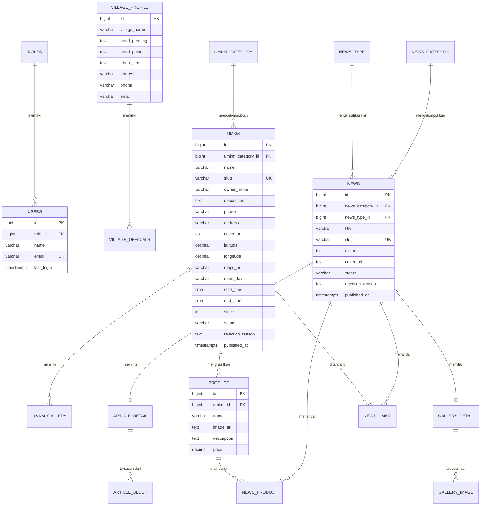
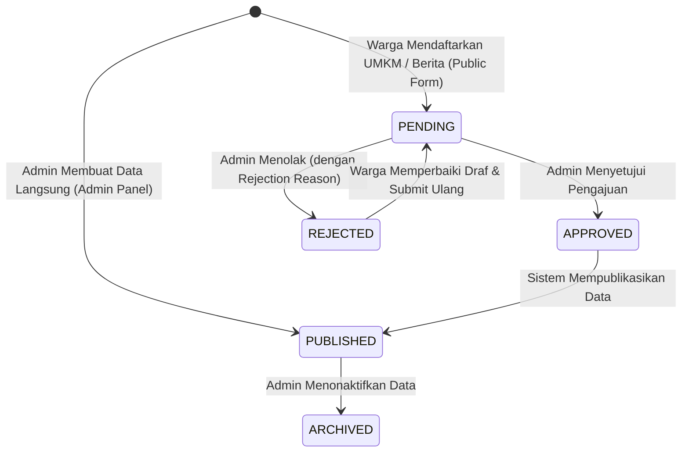

# 02. Basis Data & Prisma ORM — Web Desa Pringgodani

Dokumen ini memuat spesifikasi lengkap skema basis data PostgreSQL, diagram relasi entitas (*ERD*), model Prisma ORM, siklus hidup status data, serta panduan migrasi dan *database seeding*.

---

## 1. Diagram Relasi Entitas (*Entity Relationship Diagram - ERD*)

Berikut adalah diagram relasi seluruh tabel pada basis data Desa Pringgodani:



---

## 2. Rincian Tabel & Model Data

### A. Otentikasi & Pengguna
1. **`roles`**: Menyimpan peran akun pengguna (`admin`, `operator`, `superadmin`).
2. **`users`**: Akun pengguna terotentikasi Supabase Auth dengan referensi `role_id`.

### B. Identitas & Pemerintahan Desa
1. **`website_setting`**: Konfigurasi global nama web, logo, favicon, kontak, dan tautan sosial media desa (Facebook, Instagram, YouTube, TikTok).
2. **`village_profile`**: Informasi profil desa, sambutan kepala desa, foto kepala desa, dan deskripsi sejarah desa.
3. **`village_officials`**: Daftar struktur perangkat/aparatur desa (nama, jabatan, foto, kontak, dan ucapan).

### C. UMKM & Produk Unggulan
1. **`umkm_category`**: Kategori usaha (`Kuliner`, `Kerajinan & Souvenir`, `Pertanian & Peternakan`, `Jasa & Perdagangan`, dll).
2. **`umkm`**: Profil usaha mikro, kecil, dan menengah desa. Menyimpan koordinat geospasial (`latitude`, `longitude`), tautan Google Maps (`maps_url`), jam operasional, dan status kurasi.
3. **`umkm_gallery`**: Foto-foto galeri tempat usaha atau kegiatan produksi UMKM.
4. **`product`**: Katalog produk komoditas yang diproduksi oleh UMKM terkait (nama, harga, deskripsi, dan foto produk).

### D. Berita & Informasi Warga
1. **`news_category`**: Kategori berita (`Pemerintahan`, `Ekonomi & UMKM`, `Budaya & Tradisi`, `Pendidikan`, `Pengumuman`, dll).
2. **`news_type`**: Tipe format publikasi (`article` untuk artikel naratif bertahap, `gallery` untuk album foto liputan).
3. **`news`**: Header artikel berita utama (judul, slug unik, cuplikan ringkas, cover, dan status publikasi).
4. **`article_detail` & `article_block`**: Rincian isi artikel naratif yang tersusun dari beberapa blok konten dengan sub-judul, teks paragraf, dan ilustrasi gambar secara terurut (`sort_order`).
5. **`gallery_detail` & `gallery_image`**: Rincian album foto berita yang terdiri atas kumpulan gambar dengan deskripsi foto dan urutan tampilan.

### E. Relasi Lintas Entitas (*Many-to-Many*)
1. **`news_umkm`**: Menghubungkan artikel berita dengan UMKM yang relevan (misal: liputan bazar UMKM lokal).
2. **`news_product`**: Menghubungkan artikel berita dengan produk komoditas desa yang diliput.

---

## 3. Siklus Hidup Status Data (*Status Lifecycle*)

Tabel `umkm` dan `news` memiliki kolom status untuk mengontrol alur kurasi pengajuan warga:



* **`PENDING`**: Pengajuan baru dari formulir publik warga yang menunggu verifikasi admin.
* **`APPROVED` / `PUBLISHED`**: Data telah disetujui dan aktif ditampilkan di website publik & peta interaktif.
* **`REJECTED`**: Pengajuan ditolak oleh admin dengan catatan revisi (`rejection_reason`). Data tidak tampil di publik tetapi dapat diperbaiki oleh warga melalui tiket revisi.

---

## 4. Konfigurasi Koneksi & Pooler Prisma

Inisialisasi Prisma Client di `src/shared/database/prisma.ts` dikonfigurasi menggunakan adapter `@prisma/adapter-pg` untuk mendukung *Serverless Connection Pooling*:

```typescript
import { Pool } from "pg";
import { PrismaPg } from "@prisma/adapter-pg";
import { PrismaClient } from "@/generated/prisma/client";

const connectionString = process.env.DATABASE_URL;

const pool = new Pool({ 
  connectionString, 
  max: 10,
  idleTimeoutMillis: 30000,
  connectionTimeoutMillis: 5000,
});

const adapter = new PrismaPg(pool);
export const prisma = new PrismaClient({ adapter });
```

> [!TIP]
> Pada lingkungan produksi Supabase, gunakan **Port 6543 (Transaction Pooler)** untuk `DATABASE_URL` pada fungsi serverless, dan gunakan **Port 5432 (Session/Direct Connection)** untuk `DIRECT_URL` saat menjalankan perintah migrasi CLI.

---

## 5. Perintah CLI Prisma yang Sering Digunakan

| Perintah | Deskripsi |
| :--- | :--- |
| `npx prisma generate` | Melakukan *generate* ulang Prisma Client TypeScript berdasarkan file `schema.prisma`. |
| `npx prisma db push` | Menyinkronkan perubahan skema `schema.prisma` langsung ke basis data tanpa membuat berkas migrasi fisik (ideal untuk dev). |
| `npx prisma db seed` | Menjalankan skrip pengisian data awal (*master data & sample seed*) dari `prisma/seed.ts`. |
| `npx prisma studio` | Membuka antarmuka grafis browser lokal untuk melihat dan mengedit isi basis data secara langsung. |
| `npx prisma format` | Merapikan format indentasi dan validasi sintaks file `schema.prisma`. |
